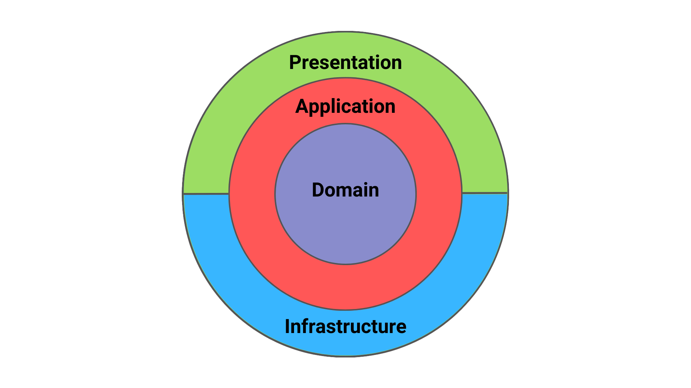

# NestJS Clean Architecture
도메인 중심 설계를 기반으로 한 NestJS Clean Architecture 구조 예시입니다.
도메인과 애플리케이션 로직을 명확하게 분리하고, 외부와의 통신은 변경에 유연하게 대응할 수 있도록 설계되어 있습니다.



📁 디렉토리 구조 예시
```
src/
  ├── main.ts                           # 애플리케이션 진입점
  ├── app.module.ts                     # 루트 모듈, 전역 모듈 등록
  ├── config/                           # 환경 설정, 모듈 설정
  │   └── config.ts
  |── common/                           # 공통 모듈 ( guard, decorator )
  ├── domain/                           # 도메인 계층 ( 비즈니스의 핵심 규칙을 담는 영역 )
  |   └──${xxx}/
  │      ├── model/                     # 도메인 모델
  │      │   └── xxx.model.ts
  │      ├── repository/                # 도메인에서 사용할 인터페이스 (구현 X)
  │      │   └── xxx.repository.interface.ts
  │      └── usecase/                   # 비즈니스 수행 로직
  │          ├── command/               # UseCase 입력 데이터 정의 (DTO와 분리된 값 객체)
  │          │   └── create-xxx.command.ts
  │          ├── create-xxx.usecase.ts
  │          └── get-xxx.usecase.ts
  ├── application/                      # 도메인 유스케이스를 조합, Dto - Command 값 변환
  │   └── ${xxx}/
  │       └── xxx.service.ts
  ├── infrastructure/                   # 외부 시스템과의 연동
  │   ├── database/
  │   │   ├── entity/                   # ORM에서 사용하는 DB Entity ( 도메인 모델과 분리 )
  │   │   │   └── ${xxx}.orm-entity.ts
  │   │   └── repository/               # 도메인 인터페이스의 실제 구현
  │   │       └── ${xxx}.orm-repository.ts
  └── presentation/                     # 외부에 노출되는 계층
      └── ${xxx}/
          ├── controller/               # API endpoint 정의
          │       └── xxx.controller.ts
          ├── dto/                      # 요청/응답 DTO
          │   ├── request/
          │   │   └── create-xxx.dto.ts
          │   └── response/
          │       └── xxx-response.dto.ts
          └── xxx.module.ts             # 해당 도메인에 대한 DI 설정
```